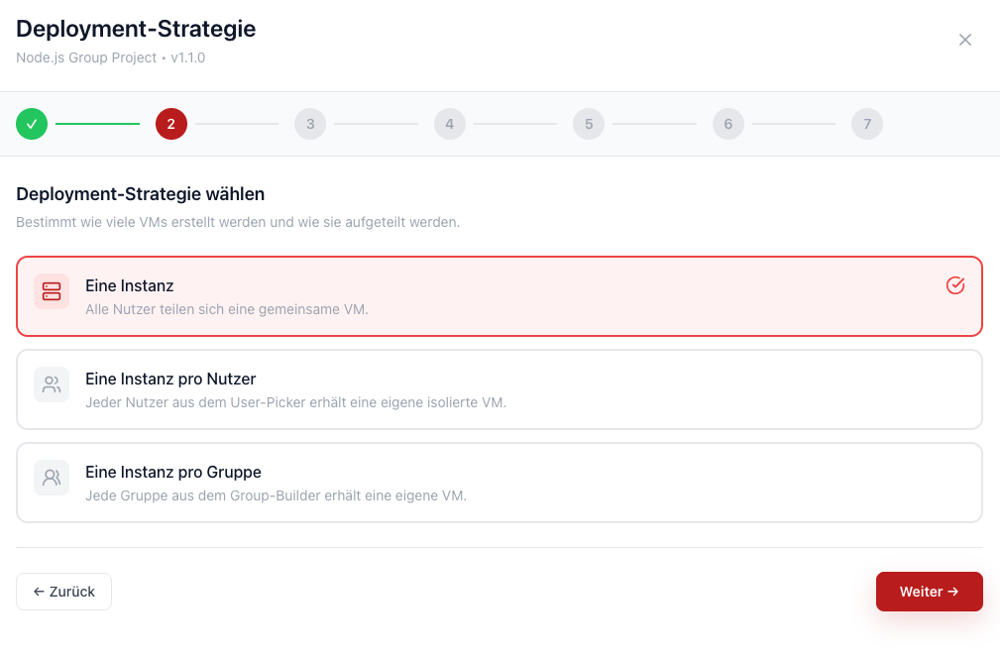
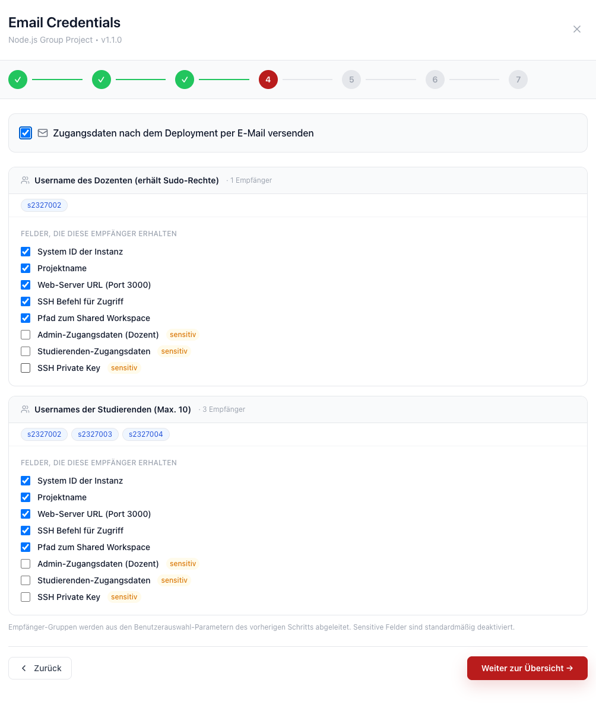

# Deploy-Strategien & Backend-Features

`deploy-strategy` steuert wie viele VMs deployt werden und für wen — eine für alle,
eine pro Nutzer oder eine pro Gruppe. Die Wahl hat direkte Auswirkungen auf das Template:
`one-per-user` und `one-per-group` setzen bestimmte Widgets in `parameters.general` voraus,
ohne die der entsprechende Modus nicht aktiviert werden kann.

`email_credentials` ist unabhängig davon und aktiviert einen optionalen Schritt nach dem Deployment,
in dem der Nutzer generierte Zugangsdaten per E-Mail versenden kann.

## `deploy-strategy`

Bestimmt welche Deployment-Modi dem Nutzer im Wizard angeboten werden.

```yaml
deploy-strategy:
  one-instance: true    # Eine VM für alle Nutzer (immer verfügbar)
  one-per-user: true    # Eine VM pro Nutzer aus dem user-picker
  one-per-group: true   # Eine VM pro Gruppe aus dem group-builder
```

Ist `deploy-strategy` nicht gesetzt, steht nur `one-instance` zur Verfügung.


Duch das Festlegen der `deploy-strategy` wird die Deplyoment-Strategie-Seite im Deplyoment-Workflow verfügbar:



---

### `one-instance`

Eine einzelne VM für alle Nutzer. Immer verfügbar, keine weiteren Voraussetzungen.

---

### `one-per-user`

Eine VM pro ausgewähltem Nutzer. Der Nutzer wählt im Wizard-Schritt 1 die Empfänger aus,
im Wizard-Schritt 2 kann jede Instanz eigene Werte erhalten (z.B. VM-Größe).

**Voraussetzung:** Ein Parameter mit `widget.type: user-picker` und `widget.multi: true`
muss in `parameters.general` vorhanden sein.

```yaml
deploy-strategy:
  one-per-user: true

parameters:
  general:
    - name: students
      type: array
      x-ui:
        widget:
          type: user-picker
          multi: true
          extract: email
```

---

### `one-per-group`

Eine VM pro Gruppe. Der Nutzer definiert im Wizard-Schritt 1 die Gruppen,
im Wizard-Schritt 2 kann jede Gruppe eigene Konfigurationswerte erhalten.

**Voraussetzung:** Ein Parameter mit `widget.type: group-builder`
muss in `parameters.general` vorhanden sein.

```yaml
deploy-strategy:
  one-per-group: true

parameters:
  general:
    - name: student_groups
      type: groups
      x-ui:
        widget:
          type: group-builder
          extract: email
```

---

## `email_credentials`

```yaml
email_credentials:
  enabled: true
```

Wenn `true`, erscheint nach dem Konfigurationsschritt ein optionaler Schritt in dem der Nutzer
Zugangsdaten nach dem Deployment per E-Mail versenden kann.

Die Empfänger werden automatisch aus `user-picker`-Parametern abgeleitet.
Sensitive Outputs (siehe [Outputs](Outputs#sensitive)) sind im E-Mail-Schritt standardmäßig deaktiviert.



---

## Zusammenspiel der Features

| Ziel | `deploy-strategy` | Benötigter Widget-Typ |
|---|---|---|
| Eine VM für alle | `one-instance: true` | — |
| Eine VM pro Nutzer | `one-per-user: true` | `user-picker` mit `multi: true` in `general` |
| Eine VM pro Gruppe | `one-per-group: true` | `group-builder` in `general` |
| E-Mail nach Deployment | `email_credentials.enabled: true` | `user-picker` (für Empfänger-Ableitung) |

Alle drei `deploy-strategy`-Modi können gleichzeitig aktiviert sein — der Nutzer wählt beim
Deployment welchen Modus er verwenden möchte.
